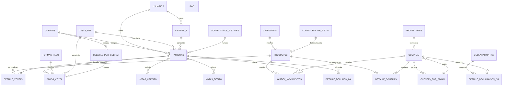

# ANÁLISIS, NORMALIZACIÓN Y DISEÑO DE SISTEMA
## Rediseño y Extrapolación del Sistema de Información — Ferretería Adrialga, C.A.

**Razón Social:** ADRIALGA, C.A. | **RIF:** J-405837357
**Dirección Fiscal:** Av. Simón Rodríguez, Casa Nro 136-41A, Sector Primero de Mayo, Barrio Campo Solo, San Diego, Valencia, Carabobo, Zona Postal 2006
**Giro:** Ferretería (pinturas, tuberías CPVC, soldadura, esmaltes, herramientas)
**Alícuotas fiscales vigentes:** G 16,00% | R 8,00% | A 31,00% | IGTF 3,00%
**Sistema actual:** SYH Software Administrativo v20.25.128 (licencia hasta 18/02/2027, estación Svr-ferreteria, usuario ACEDENO)

---

# SECCIÓN 1 — DIAGNÓSTICO INTEGRADO DE PROCESOS (MANUAL vs SYH ACTUAL)

## 1.1 Comparativa Fase por Fase: Proceso Manual (Flujograma 5 Carriles) vs Proceso Informatizado (SYH)

| # | Fase del flujograma manual (papel) | Implementación en SYH actual | Grado de automatización | Brecha detectada |
|---|-----------------------------------|------------------------------|------------------------|------------------|
| 0 | Apertura: Contador abre Libro Diario y Libro CxP; Propietario decide capital | No existe módulo de apertura de caja formal; el usuario inicia sesión y opera directo | Parcial | No hay control de "caja abierta" ni presupuesto diario |
| 1 | Cliente llega y solicita mercancía verbalmente | El vendedor digita el código (ej. 080) o busca en catálogo | Total | La búsqueda es por código exacto; no hay buscador semántico por nombre |
| 2 | Verificación de stock en almacén físico; Lista de Faltantes del Día | El sistema valida stock en base de datos al cargar la línea | Total (parcial) | No genera automáticamente lista de faltantes ni sugiere reposición |
| 3 | Carga del pedido en Nota de Pedido manual (cantidad, precio, subtotal) | Grilla de facturación con P/U+IVA, IVA 16% y Total+IVA por línea | Total | El precio se muestra con IVA incluido (práctica venezolana) |
| 4 | Bucle "¿Desea algo más?" | El vendedor continúa agregando líneas hasta presionar F4 | Total | — |
| 5 | Identificación del cliente: fichero físico o Ficha de Registro | Tecla F9 (Clientes): búsqueda por cédula/RIF o registro en caliente | Total | El registro en caliente es obligatorio antes de cobrar |
| 6 | Traspaso de Nota de Pedido al área de caja | La misma pantalla POS hace de vendedor y cajero | Total | Un solo rol operativo; no hay separación de funciones |
| 7 | Totalización manual con calculadora (BI + IVA 16% = Total Bs/REF) | Ventana "Totalizar Factura" (F4): Total Bruto, Recargos, Descuentos, Neto, IVA, Total, Abonos, Saldo REF y Bs | Total | La tasa REF se carga manualmente (ej. 742,81 Bs/REF) |
| 8 | Selección de pago; Planilla de Cobranzas; Factura Fiscal impresa | Centro de Cobranzas (F10): moneda (USD/Bs), 5 formas de pago, pagos mixtos, vuelto en tiempo real; F11 procesa e imprime | Total | El sistema permite USD aunque la política interna es Bs |
| 9 | Entrega de mercancía con copia de factura como autorización | El sistema no controla la entrega física; depende del operador | Parcial | No hay módulo de "despacho/entrega" ni firma de recepción |
| 10 | Cuadre de caja manual + Reporte Z manual | Módulo "Cuadre de Caja Por Usuario" + Corte Zeta | Total | El Reporte Z se genera por usuario, no consolidado por caja |
| 11 | Cuadre con contador: facturas vs planilla vs efectivo | El contador compara manualmente los reportes impresos | Parcial | No hay conciliación automática ni bandeja de discrepancias |
| 12 | Cierre del día contable: Libro Diario / Libro de Ventas | El sistema registra el Libro de Ventas interno automáticamente | Total | El Libro Diario sigue siendo manual en el contador |
| 13 | Recepción de Lista de Faltantes y priorización de compras | No existe módulo de faltantes ni sugerencia de compra | **Inexistente** | Brecha funcional importante |
| 14 | Consulta financiera: CxP y caja disponible | Módulo "Cuentas por Pagar" consultable | Total | No hay flujo de aprobación de compra |
| 15 | Decisión de compra (capital suficiente) | Decisión humana fuera del sistema | No | No hay control presupuestario |
| 16 | Orden de Compra manual | No existe módulo de Orden de Compra | **Inexistente** | Brecha funcional importante |
| 17 | Confirmación del proveedor | No existe | **Inexistente** | — |
| 18 | Entrega de mercancía + Nota de Entrega/Factura de compra | No existe seguimiento de recepción | **Inexistente** | — |
| 19 | Verificación física en almacén | Módulo "Entrada de Inventario" registra lo recibido | Total | No hay control de discrepancias vs orden de compra |
| 20 | Registro contable: Kárdex, Libro de Compras, CxP | El sistema actualiza stock, Libro de Compras y CxP automáticamente | Total | El Kárdex físico del contador queda redundante |
| 21 | Pago a proveedor (solo Bs) + Recibo de Pago manual | Módulo "Cuentas por Pagar" registra abonos | Total | El recibo impreso depende de impresora local |
| 22 | Actualización de CxP (DEBE/HABER, saldo, SALDADO) | Automático en el módulo CxP | Total | — |
| 23 | Declaración IVA: Hoja de Trabajo con líneas SENIAT 1-28 | Módulo "Resumen Declaración del IVA": líneas 1-28, prorrata, "Igualar Calculado con lo Declarado", "SENIAT en Línea" | Total | El portal SENIAT se abre externamente; no hay envío automático |
| 24 | Fin: cuadre validado, inventario actualizado, obligaciones cumplidas | Cierre manual del día | Parcial | No hay cierre de período que bloquee ediciones |

## 1.2 Problemas Críticos del Sistema Actual (SYH)

### A. Desorganización de la interfaz — Menú "Favoritos" plano
El menú de favoritos del SYH concentra **12+ funciones sin jerarquía lógica** en una sola lista plana:

```
Ajustes Montos Compras y Gastos
Anulación de Operaciones en Compras
Catálogo de Productos
Consola Fiscal
Cuadre de Caja Por Usuario
Cuentas por Cobrar
Cuentas por Pagar
Devoluciones en Ventas
Entrada de Inventario
Pagos o Abono de Nota de Crédito Clientes
POS Touch Screen
Reimpresiones Varias en Ventas
Repreciar Artículos
Resumen Declaración del IVA
```

**Problemas derivados:**
1. **Sin jerarquía de módulos:** funciones de compras, ventas, inventario, fiscal y configuración conviven al mismo nivel. Un cajero novato no distingue "Entrada de Inventario" (almacén) de "Entrada de Inventario" (compras) ni "Consola Fiscal" de "Resumen Declaración del IVA".
2. **Alto costo cognitivo:** el operador debe memorizar la posición de cada opción; no hay agrupación por rol (cajero vs contador vs almacén).
3. **Sin control de permisos por módulo:** cualquier usuario con acceso al menú puede abrir "Ajustes Montos Compras y Gastos" o "Repreciar Artículos", funciones sensibles que deberían estar restringidas a administrador.
4. **Sin buscador de funciones:** a medida que el ERP crece, el menú plano se vuelve inmanejable.
5. **Mezcla de frecuencia de uso:** "POS Touch Screen" (uso diario, cada 5 minutos) está al mismo nivel que "Ajustes Montos Compras" (uso mensual).

### B. Problemas técnicos y operativos
1. **Arquitectura de escritorio local:** el sistema corre solo en la estación Svr-ferreteria; no es accesible desde tablets ni teléfonos. El dueño no puede consultar ventas del día desde su casa.
2. **Licencia por estación con vencimiento:** la licencia vence el 18/02/2027; el negocio queda expuesto a costos de renovación y a la dependencia del proveedor.
3. **Tasa REF cargada manualmente:** el factor de cambio (742,81 Bs/REF) debe ser ingresado a mano; riesgo de error humano y de desactualización intradía.
4. **Impresora fiscal local obligatoria:** si la impresora falla, la venta queda en cola y no se puede emitir factura; no hay contingencia en la nube.
5. **Sin respaldo en la nube:** la base de datos vive en el disco local; un fallo del disco pierde el Libro de Ventas y el histórico fiscal.
6. **Sin control de despacho/entrega:** la Fase 9 (entrega de mercancía) no está controlada por el sistema; no hay firma de recepción ni trazabilidad de quién entregó.
7. **Sin módulo de Orden de Compra ni Lista de Faltantes:** las fases 13-18 del proceso manual no tienen equivalente digital; el abastecimiento sigue siendo un proceso de papel.
8. **Doble digitación contable:** el contador aún mantiene Libro Diario y Kárdex físico en paralelo al sistema, duplicando trabajo y riesgo de error.
9. **Sin auditoría de roles:** el mismo usuario puede vender, cobrar, anular y repreciar; no hay separación de funciones (SoD).
10. **Sin reportes móviles:** no hay dashboard de ventas, inventario ni CxP accesible desde el celular del propietario.

---

# SECCIÓN 2 — DIAGRAMA ENTIDAD-RELACIÓN (ERD) Y ESQUEMA EN 3NF

## 2.1 Normalización a Tercera Forma Normal (3NF)

### Entidades extraídas del negocio
1. **Clientes** (de Fase 5 y Caso de Uso 2)
2. **Productos** (de Catálogo y factura #000339)
3. **Kárdex / Movimientos de Inventario** (de Fase 20)
4. **Proveedores** (de Fases 16-22)
5. **Compras** (encabezado, de Fase 20)
6. **Detalle_Compras** (de Fase 20)
7. **Facturas / Ventas** (encabezado, de Fases 7-9)
8. **Detalle_Ventas** (de Fase 3)
9. **Formas_Pago** (catálogo, de Fase 8)
10. **Pagos_Venta** (pagos mixtos, del Centro de Cobranzas)
11. **Notas_Credito** (de Devoluciones en Ventas)
12. **Notas_Debito** (de ajustes)
13. **Cierres_Z / Reporte Z** (de Fase 10)
14. **Cuentas_por_Cobrar** (de abonos parciales y NC a favor)
15. **Cuentas_por_Pagar** (de Fase 21-22)
16. **Tasas_REF** (tasa BCV diaria)
17. **Declaracion_IVA** (encabezado, de Fase 23)
18. **Detalle_Declaracion_IVA** (líneas SENIAT 1-28)
19. **Usuarios** (de sesión ACEDENO)
20. **Correlativos_Fiscales** (control de numeración de impresora fiscal)
21. **Configuracion_Fiscal** (alícuotas G/R/A, IGTF, prorrata)

### 2.1.1 Eliminación de dependencias parciales (2NF)
En el diseño no normalizado, la tabla `Detalle_Ventas` tendría la clave compuesta `(id_factura, id_producto)` y contendría atributos como `descripcion_producto`, `precio_producto` y `alicuota_producto`. Estos atributos dependen **solo de `id_producto`** (dependencia parcial), no de la clave completa. Se elimina moviendo esos atributos a la tabla `Productos`, dejando en `Detalle_Ventas` solo `precio_unitario_venta` (precio histórico de la transacción, que sí depende de la línea completa).

### 2.1.2 Eliminación de dependencias transitivas (3NF)
- En `Facturas`, el atributo `nombre_cliente` depende de `id_cliente` (no de `id_factura`): dependencia transitiva. Se elimina dejando solo `id_cliente` como FK.
- En `Productos`, el atributo `nombre_categoria` depende de `id_categoria` (transitiva). Se crea la tabla `Categorias`.
- En `Facturas`, el atributo `tasa_ref_dia` depende de la fecha (transitiva). Se crea la tabla `Tasas_REF` con clave `(fecha)`.
- En `Detalle_Ventas`, el atributo `alicuota_iva` depende del producto y de la fecha de vigencia fiscal, no de la línea de venta. Se modela en `Productos` (alícuota vigente) y se congela en la línea de venta como `alicuota_aplicada` (histórico, no derivable).

### 2.1.3 Resultado: todas las tablas en 3NF
Cada tabla tiene clave primaria simple o compuesta sin dependencias parciales, y todos los atributos no clave dependen solo de la clave primaria (sin transitividad).

## 2.2 Diagrama ERD en Mermaid



## 2.3 Esquema de Base de Datos Relacional (SQL)

```sql
-- ============================================================
-- ESQUEMA RELACIONAL 3NF — FERRETERÍA ADRIALGA, C.A.
-- Motor recomendado: PostgreSQL 16+ (o SQLite para despliegue local)
-- ============================================================

-- 1. CATÁLOGO BASE -------------------------------------------------
CREATE TABLE categorias (
    id_categoria      SERIAL PRIMARY KEY,
    nombre            VARCHAR(80)  NOT NULL UNIQUE,
    descripcion       VARCHAR(200),
    activo            BOOLEAN      NOT NULL DEFAULT TRUE
);

CREATE TABLE clientes (
    id_cliente        SERIAL PRIMARY KEY,
    tipo_documento    CHAR(1)      NOT NULL CHECK (tipo_documento IN ('V','E','J','G','P')),
    documento         VARCHAR(12)  NOT NULL UNIQUE,
    nombre_razon      VARCHAR(150) NOT NULL,
    direccion         VARCHAR(250),
    telefono          VARCHAR(20),
    email             VARCHAR(120),
    es_contribuyente_especial BOOLEAN NOT NULL DEFAULT FALSE,
    exonerado_iva     BOOLEAN      NOT NULL DEFAULT FALSE,
    fecha_registro    TIMESTAMP    NOT NULL DEFAULT CURRENT_TIMESTAMP,
    activo            BOOLEAN      NOT NULL DEFAULT TRUE,
    CONSTRAINT chk_documento_formato CHECK (documento ~ '^[0-9]{6,10}$')
);

CREATE TABLE proveedores (
    id_proveedor      SERIAL PRIMARY KEY,
    tipo_documento    CHAR(1)      NOT NULL CHECK (tipo_documento IN ('J','V','G')),
    documento         VARCHAR(12)  NOT NULL UNIQUE,
    razon_social      VARCHAR(150) NOT NULL,
    contacto          VARCHAR(100),
    telefono          VARCHAR(50),
    email             VARCHAR(120),
    direccion         VARCHAR(255),
    dias_credito      SMALLINT     NOT NULL DEFAULT 0 CHECK (dias_credito >= 0),
    activo            BOOLEAN      NOT NULL DEFAULT TRUE
);

CREATE TABLE productos (
    id_producto       SERIAL PRIMARY KEY,
    codigo            VARCHAR(20)  NOT NULL UNIQUE,
    codigo_barras     VARCHAR(30),
    nombre            VARCHAR(150) NOT NULL,
    descripcion       VARCHAR(255),
    id_categoria      INTEGER      NOT NULL REFERENCES categorias(id_categoria),
    unidad_medida     VARCHAR(10)  NOT NULL DEFAULT 'UND',
    precio_venta_bs   NUMERIC(14,2) NOT NULL CHECK (precio_venta_bs >= 0),
    costo_promedio_bs NUMERIC(14,2) NOT NULL DEFAULT 0 CHECK (costo_promedio_bs >= 0),
    stock_minimo      NUMERIC(12,2) NOT NULL DEFAULT 0 CHECK (stock_minimo >= 0),
    stock_actual      NUMERIC(12,2) NOT NULL DEFAULT 0 CHECK (stock_actual >= 0),
    id_alicuota       INTEGER      NOT NULL REFERENCES configuracion_fiscal(id_alicuota),
    activo            BOOLEAN      NOT NULL DEFAULT TRUE,
    CONSTRAINT chk_precio_venta_mayor_costo CHECK (precio_venta_bs >= costo_promedio_bs)
);

-- 2. FISCAL
CREATE TABLE configuracion_fiscal (
    id_alicuota       SERIAL PRIMARY KEY,
    codigo_seniat     VARCHAR(5)   NOT NULL UNIQUE,  -- 'G','R','A'
    descripcion       VARCHAR(60)  NOT NULL,
    porcentaje        NUMERIC(5,2) NOT NULL CHECK (porcentaje IN (0, 8, 16, 31)),
    vigente_desde     DATE         NOT NULL,
    vigente_hasta     DATE,
    CONSTRAINT chk_rango CHECK (porcentaje BETWEEN 0 AND 100)
);

CREATE TABLE tasas_ref (
    id_tasa           SERIAL PRIMARY KEY,
    fecha             DATE         NOT NULL UNIQUE,
    tasa_bs_por_ref   NUMERIC(14,4) NOT NULL CHECK (tasa_bs_por_ref > 0),
    fuente            VARCHAR(30)  NOT NULL DEFAULT 'BCV',
    actualizada_por   INTEGER      REFERENCES usuarios(id_usuario)
);

CREATE TABLE correlativos_fiscales (
    id_correlativo    SERIAL PRIMARY KEY,
    tipo_documento    VARCHAR(10)  NOT NULL,  -- 'FACTURA','NC','ND','Z'
    numero_actual     BIGINT       NOT NULL DEFAULT 0 CHECK (numero_actual >= 0),
    rango_inicial     BIGINT       NOT NULL,
    rango_final       BIGINT       NOT NULL,
    activo            BOOLEAN      NOT NULL DEFAULT TRUE,
    CONSTRAINT chk_rango CHECK (rango_final >= rango_inicial)
);

-- 3. VENTAS / FACTURACIÓN
CREATE TABLE facturas (
    id_factura        SERIAL PRIMARY KEY,
    numero_fiscal     BIGINT       NOT NULL UNIQUE,
    id_cliente        INTEGER      NOT NULL REFERENCES clientes(id_cliente),
    id_usuario        INTEGER      NOT NULL REFERENCES usuarios(id_usuario),
    id_tasa           INTEGER      NOT NULL REFERENCES tasas_ref(id_tasa),
    fecha_emision     TIMESTAMP    NOT NULL DEFAULT CURRENT_TIMESTAMP,
    tipo_operacion    CHAR(1)      NOT NULL DEFAULT 'F' CHECK (tipo_operacion IN ('F','NC','ND')),
    total_bruto       NUMERIC(14,2) NOT NULL DEFAULT 0 CHECK (total_bruto >= 0),
    total_descuentos  NUMERIC(14,2) NOT NULL DEFAULT 0 CHECK (total_descuentos >= 0),
    total_recargos    NUMERIC(14,2) NOT NULL DEFAULT 0 CHECK (total_recargos >= 0),
    base_imponible    NUMERIC(14,2) NOT NULL DEFAULT 0 CHECK (base_imponible >= 0),
    total_iva         NUMERIC(14,2) NOT NULL DEFAULT 0 CHECK (total_iva >= 0),
    total_igtf        NUMERIC(14,2) NOT NULL DEFAULT 0 CHECK (total_igtf >= 0),
    total_operacion   NUMERIC(14,2) NOT NULL DEFAULT 0 CHECK (total_operacion >= 0),
    total_operacion_ref NUMERIC(14,4) NOT NULL DEFAULT 0,
    estado            VARCHAR(20)   NOT NULL DEFAULT 'EMITIDA'
                      CHECK (estado IN ('BORRADOR','EMITIDA','ANULADA','PENDIENTE_CONFIRMACION')),
    codigo_seguridad  VARCHAR(20),
    anulada_por       INTEGER      REFERENCES usuarios(id_usuario),
    motivo_anulacion  VARCHAR(255),
    CONSTRAINT chk_total CHECK (total_operacion = base_imponible + total_iva + total_igtf)
);

CREATE TABLE detalle_ventas (
    id_detalle        SERIAL PRIMARY KEY,
    id_factura        INTEGER      NOT NULL REFERENCES facturas(id_factura) ON DELETE CASCADE,
    id_producto       INTEGER      NOT NULL REFERENCES productos(id_producto),
    cantidad          NUMERIC(12,2) NOT NULL CHECK (cantidad > 0),
    precio_unitario   NUMERIC(14,2) NOT NULL CHECK (precio_unitario >= 0),
    alicuota_aplicada NUMERIC(5,2)  NOT NULL CHECK (alicuota_aplicada IN (0, 8, 16, 31)),
    descuento_linea   NUMERIC(14,2) NOT NULL DEFAULT 0 CHECK (descuento_linea >= 0),
    recargo_linea     NUMERIC(14,2) NOT NULL DEFAULT 0 CHECK (recargo_linea >= 0),
    subtotal          NUMERIC(14,2) NOT NULL CHECK (subtotal >= 0),
    iva_linea         NUMERIC(14,2) NOT NULL CHECK (iva_linea >= 0),
    CONSTRAINT chk_subtotal CHECK (subtotal = (cantidad * precio_unitario) - descuento_linea + recargo_linea)
);

CREATE TABLE formas_pago (
    id_forma_pago     SERIAL PRIMARY KEY,
    nombre            VARCHAR(40)   NOT NULL UNIQUE,  -- 'Efectivo BS','Pago Móvil','Transferencia','Débito','Crédito'
    requiere_confirmacion BOOLEAN   NOT NULL DEFAULT FALSE,
    activo            BOOLEAN       NOT NULL DEFAULT TRUE
);

CREATE TABLE pagos_venta (
    id_pago           SERIAL PRIMARY KEY,
    id_factura        INTEGER       NOT NULL REFERENCES facturas(id_factura) ON DELETE CASCADE,
    id_forma_pago     INTEGER       NOT NULL REFERENCES formas_pago(id_forma_pago),
    id_tasa           INTEGER       NOT NULL REFERENCES tasas_ref(id_tasa),
    moneda            CHAR(2)       NOT NULL DEFAULT 'BS' CHECK (moneda IN ('BS','USD')),
    monto_bs          NUMERIC(14,2) NOT NULL CHECK (monto_bs >= 0),
    monto_ref         NUMERIC(14,4) NOT NULL CHECK (monto_ref >= 0),
    vuelto_bs         NUMERIC(14,2) NOT NULL DEFAULT 0 CHECK (vuelto_bs >= 0),
    referencia        VARCHAR(50),   -- N° de operación pago móvil / transferencia
    confirmado        BOOLEAN       NOT NULL DEFAULT TRUE,
    fecha_pago        TIMESTAMP     NOT NULL DEFAULT CURRENT_TIMESTAMP
);

-- 4. COMPRAS / ABASTECIMIENTO
CREATE TABLE compras (
    id_compra         SERIAL PRIMARY KEY,
    id_proveedor      INTEGER       NOT NULL REFERENCES proveedores(id_proveedor),
    id_usuario        INTEGER       NOT NULL REFERENCES usuarios(id_usuario),
    numero_factura_proveedor VARCHAR(30),
    fecha_compra      TIMESTAMP     NOT NULL DEFAULT CURRENT_TIMESTAMP,
    base_imponible    NUMERIC(14,2) NOT NULL DEFAULT 0 CHECK (base_imponible >= 0),
    total_iva         NUMERIC(14,2) NOT NULL DEFAULT 0 CHECK (total_iva >= 0),
    total_compra      NUMERIC(14,2) NOT NULL DEFAULT 0 CHECK (total_compra >= 0),
    estado            CHAR(1)       NOT NULL DEFAULT 'P' CHECK (estado IN ('P','C','A')), -- Pendiente/Confirmada/Anulada
    CONSTRAINT chk_total_compra CHECK (total_compra = base_imponible + total_iva)
);

CREATE TABLE detalle_compras (
    id_detalle        SERIAL PRIMARY KEY,
    id_compra         INTEGER       NOT NULL REFERENCES compras(id_compra) ON DELETE CASCADE,
    id_producto       INTEGER       NOT NULL REFERENCES productos(id_producto),
    cantidad          NUMERIC(12,2) NOT NULL CHECK (cantidad > 0),
    costo_unitario    NUMERIC(14,2) NOT NULL CHECK (costo_unitario >= 0),
    alicuota_aplicada NUMERIC(5,2)  NOT NULL CHECK (alicuota_aplicada IN (0, 8, 16, 31)),
    subtotal          NUMERIC(14,2) NOT NULL CHECK (subtotal >= 0),
    iva_linea         NUMERIC(14,2) NOT NULL CHECK (iva_linea >= 0)
);

-- 5. INVENTARIO / KÁRDEX
CREATE TABLE kardex_movimientos (
    id_movimiento     SERIAL PRIMARY KEY,
    id_producto       INTEGER       NOT NULL REFERENCES productos(id_producto),
    tipo_movimiento   CHAR(1)       NOT NULL CHECK (tipo_movimiento IN ('E','S','A','D')),  -- Entrada, Salida, Ajuste+, Ajuste-
    id_factura        INTEGER       REFERENCES facturas(id_factura),
    id_compra         INTEGER       REFERENCES compras(id_compra),
    cantidad          NUMERIC(12,2) NOT NULL CHECK (cantidad <> 0),
    costo_unitario    NUMERIC(14,2) NOT NULL,
    stock_anterior    NUMERIC(12,2) NOT NULL,
    stock_nuevo       NUMERIC(12,2) NOT NULL,
    fecha_movimiento  TIMESTAMP     NOT NULL DEFAULT CURRENT_TIMESTAMP,
    id_usuario        INTEGER       NOT NULL REFERENCES usuarios(id_usuario),
    observacion       VARCHAR(255),
    CONSTRAINT chk_stock_no_negativo CHECK (stock_nuevo >= 0)
);

-- 6. NOTAS DE CRÉDITO / DÉBITO
CREATE TABLE notas_credito (
    id_nc             SERIAL PRIMARY KEY,
    id_factura        INTEGER       NOT NULL REFERENCES facturas(id_factura),
    numero_fiscal     BIGINT        NOT NULL UNIQUE,
    fecha_emision     TIMESTAMP     NOT NULL DEFAULT CURRENT_TIMESTAMP,
    motivo            VARCHAR(255)  NOT NULL,
    base_imponible    NUMERIC(14,2) NOT NULL CHECK (base_imponible >= 0),
    total_iva         NUMERIC(14,2) NOT NULL CHECK (total_iva >= 0),
    total_nc          NUMERIC(14,2) NOT NULL CHECK (total_nc >= 0),
    estado            CHAR(1)       NOT NULL DEFAULT 'E' CHECK (estado IN ('E','A'))  -- Emitida, Aplicada
);

CREATE TABLE notas_debito (
    id_nd             SERIAL PRIMARY KEY,
    id_factura        INTEGER       NOT NULL REFERENCES facturas(id_factura),
    numero_nd         BIGINT        NOT NULL UNIQUE,
    motivo            VARCHAR(255)  NOT NULL,
    monto             NUMERIC(14,2) NOT NULL CHECK (monto > 0),
    fecha_emision     TIMESTAMP     NOT NULL DEFAULT CURRENT_TIMESTAMP
);

-- 7. CUENTAS POR COBRAR / PAGAR
CREATE TABLE cuentas_por_cobrar (
    id_cxc            SERIAL PRIMARY KEY,
    id_factura        INTEGER       NOT NULL REFERENCES facturas(id_factura),
    id_cliente        INTEGER       NOT NULL REFERENCES clientes(id_cliente),
    monto_original    NUMERIC(14,2) NOT NULL CHECK (monto_original > 0),
    monto_pagado      NUMERIC(14,2) NOT NULL DEFAULT 0 CHECK (monto_pagado >= 0),
    saldo             NUMERIC(14,2) NOT NULL CHECK (saldo >= 0),
    fecha_vencimiento DATE          NOT NULL,
    estado            CHAR(1)       NOT NULL DEFAULT 'P' CHECK (estado IN ('P','S','V'))  -- Pendiente, Saldada, Vencida
);

CREATE TABLE cuentas_por_pagar (
    id_cxp            SERIAL PRIMARY KEY,
    id_compra         INTEGER       NOT NULL REFERENCES compras(id_compra),
    id_proveedor      INTEGER       NOT NULL REFERENCES proveedores(id_proveedor),
    monto_original    NUMERIC(14,2) NOT NULL CHECK (monto_original > 0),
    monto_pagado      NUMERIC(14,2) NOT NULL DEFAULT 0 CHECK (monto_pagado >= 0),
    saldo             NUMERIC(14,2) NOT NULL CHECK (saldo >= 0),
    fecha_corte       DATE          NOT NULL,
    estado            CHAR(1)       NOT NULL DEFAULT 'P' CHECK (estado IN ('P','S','V'))
);

-- 8. CIERRE Z Y FISCAL
CREATE TABLE cierres_z (
    id_cierre         SERIAL PRIMARY KEY,
    id_usuario        INTEGER       NOT NULL REFERENCES usuarios(id_usuario),
    fecha_cierre      DATE          NOT NULL,
    hora_cierre       TIME          NOT NULL,
    factura_desde     BIGINT        NOT NULL,
    factura_hasta     BIGINT        NOT NULL,
    total_ventas_bs   NUMERIC(14,2) NOT NULL CHECK (total_ventas_bs >= 0),
    total_ventas_ref  NUMERIC(14,4) NOT NULL CHECK (total_ventas_ref >= 0),
    total_iva_bs      NUMERIC(14,2) NOT NULL CHECK (total_iva_bs >= 0),
    total_igtf_bs     NUMERIC(14,2) NOT NULL CHECK (total_igtf_bs >= 0),
    diferencia        NUMERIC(14,2) NOT NULL DEFAULT 0,
    estado            CHAR(1)       NOT NULL DEFAULT 'A' CHECK (estado IN ('A','C'))  -- Abierto, Cerrado
);

CREATE TABLE declaracion_iva (
    id_declaracion    SERIAL PRIMARY KEY,
    periodo_desde     DATE          NOT NULL,
    periodo_hasta     DATE          NOT NULL,
    id_usuario        INTEGER       NOT NULL REFERENCES usuarios(id_usuario),
    porcentaje_prorrata NUMERIC(5,2) NOT NULL DEFAULT 0 CHECK (porcentaje_prorrata BETWEEN 0 AND 100),
    total_debitos     NUMERIC(14,2) NOT NULL DEFAULT 0,
    total_creditos    NUMERIC(14,2) NOT NULL DEFAULT 0,
    cuota_tributaria  NUMERIC(14,2) NOT NULL DEFAULT 0,
    excedente_mes_siguiente NUMERIC(14,2) NOT NULL DEFAULT 0,
    estado            CHAR(1)       NOT NULL DEFAULT 'B' CHECK (estado IN ('B','D','P'))  -- Borrador, Declarada, Procesada
);

CREATE TABLE detalle_declaracion_iva (
    id_detalle        SERIAL PRIMARY KEY,
    id_declaracion    INTEGER       NOT NULL REFERENCES declaracion_iva(id_declaracion) ON DELETE CASCADE,
    linea_seniat      SMALLINT      NOT NULL CHECK (linea_seniat BETWEEN 1 AND 28),
    numero_control    VARCHAR(10)   NOT NULL,   -- Núm. 40, 41, 42, 43, 442, 452, ...
    base_imponible    NUMERIC(14,2) NOT NULL DEFAULT 0 CHECK (base_imponible >= 0),
    monto_impuesto    NUMERIC(14,2) NOT NULL DEFAULT 0 CHECK (monto_impuesto >= 0),
    CONSTRAINT uq_linea_declaracion UNIQUE (id_declaracion, linea_seniat)
);

-- 9. USUARIOS Y SEGURIDAD
CREATE TABLE usuarios (
    id_usuario        SERIAL PRIMARY KEY,
    nombre_usuario    VARCHAR(30)   NOT NULL UNIQUE,
    nombre_completo   VARCHAR(120)  NOT NULL,
    password_hash     VARCHAR(255)  NOT NULL,
    rol               VARCHAR(20)   NOT NULL CHECK (rol IN ('ADMIN','CAJERO','ALMACEN','CONTADOR','PROPIETARIO')),
    activo            BOOLEAN       NOT NULL DEFAULT TRUE,
    ultimo_acceso     TIMESTAMP
);

-- 10. ÍNDICES DE RENDIMIENTO
CREATE INDEX idx_facturas_fecha ON facturas(fecha_emision);
CREATE INDEX idx_facturas_cliente ON facturas(id_cliente);
CREATE INDEX idx_detalle_ventas_producto ON detalle_ventas(id_producto);
CREATE INDEX idx_kardex_producto_fecha ON kardex_movimientos(id_producto, fecha_movimiento);
CREATE INDEX idx_pagos_factura ON pagos_venta(id_factura);
CREATE INDEX idx_declaracion_periodo ON declaracion_iva(periodo_desde, periodo_hasta);
```

### 2.3.1 Verificación de integridad referencial y reglas de negocio
- **Montos no negativos:** `CHECK (monto >= 0)` en todos los campos monetarios.
- **Alícuotas válidas:** `CHECK (porcentaje IN (0, 8, 16, 31))` en `configuracion_fiscal` y en las líneas de detalle.
- **Stock no negativo:** `CHECK (stock_nuevo >= 0)` en kárdex; el sistema debe bloquear ventas sin stock.
- **Total de factura consistente:** `CHECK (total_operacion = base_imponible + total_iva + total_igtf)`.
- **Subtotal de línea consistente:** `CHECK (subtotal = (cantidad * precio_unitario) - descuento_linea + recargo_linea)`.
- **Correlatividad fiscal:** `correlativos_fiscales` garantiza que no haya saltos en la numeración de la impresora fiscal.
- **Unicidad de documento:** `UNIQUE` en documento de clientes/proveedores y en número de factura.

---

# SECCIÓN 3 — ESPECIFICACIÓN DEL PROTOTIPO EN PAPEL Y ARQUITECTURA UI/UX

## 3.1 Estructura Modular de Menús (reemplaza el "Favoritos" plano)

```
┌─────────────────────────────────────────────────────────────────────┐
│  ADRIALGA, C.A. — RIF J-405837357        [Usuario: ACEDENO] [Salir] │
├─────────────────────────────────────────────────────────────────────┤
│  ☰ MENÚ PRINCIPAL                                                    │
│                                                                     │
│  🛒 VENTAS & POS                                                     │
│     ├─ Punto de Venta (POS Touch)          ← acceso directo F1      │
│     ├─ Devoluciones / Notas de Crédito                              │
│     ├─ Reimpresiones de Facturas                                    │
│     └─ Consulta de Ventas                                            │
│                                                                     │
│  📦 INVENTARIO & ALMACÉN                                             │
│     ├─ Catálogo de Productos                                        │
│     ├─ Entrada de Inventario (compras)                              │
│     ├─ Kárdex / Movimientos                                         │
│     ├─ Lista de Faltantes y Sugerencia de Reposición                │
│     └─ Ajustes de Inventario                                        │
│                                                                     │
│  🛒 COMPRAS & PROVEEDORES                                            │
│     ├─ Orden de Compra                                              │
│     ├─ Recepción de Mercancía (vs Orden)                            │
│     ├─ Registro de Proveedores                                      │
│     └─ Cuentas por Pagar                                            │
│                                                                     │
│  💰 CUENTAS POR COBRAR / PAGAR                                       │
│     ├─ Centro de Cobranzas (créditos)                               │
│     ├─ Cuentas por Cobrar                                           │
│     ├─ Cuentas por Pagar                                            │
│     └─ Abonos de Notas de Crédito                                   │
│                                                                     │
│  🏛️ MÓDULO FISCAL SENIAT                                            │
│     ├─ Consola Fiscal (Reporte Z / Corte X)                         │
│     ├─ Resumen Declaración del IVA (líneas 1-28)                    │
│     ├─ Libro de Ventas                                              │
│     ├─ Libro de Compras                                             │
│     └─ Cuadre de Caja por Usuario                                   │
│                                                                     │
│  ⚙️ CONFIGURACIÓN & USUARIOS                                         │
│     ├─ Usuarios y Roles (permisos por módulo)                       │
│     ├─ Tasa REF / BCV (carga diaria)                                │
│     ├─ Alícuotas y Parámetros Fiscales                              │
│     ├─ Impresora Fiscal / Correlativos                              │
│     └─ Respaldo y Restauración                                      │
└─────────────────────────────────────────────────────────────────────┘
```

**Principios de diseño:**
- **Jerarquía de 2 niveles** (módulo → función) con iconos y colores por dominio.
- **Accesos rápidos por teclado** (F1 POS, F2 Clientes, F3 Catálogo) para el cajero.
- **Permisos por rol:** el cajero solo ve Ventas & POS + Cobranzas; el contador ve Fiscal + CxP; el almacén ve Inventario + Compras; el propietario ve todo + Configuración.
- **Buscador global** en la barra superior (busca módulos, productos, clientes, facturas).
- **Responsive:** en móvil el menú se colapsa en un drawer lateral (hamburguesa).

## 3.2 Pantalla POS Touch / Responsive (prototipo en papel)

```
┌────────────────────────────────────────────────────────────────────────────┐
│ ADRIALGA, C.A.  •  POS TOUCH          [Cliente: Juan R. Crespo V-086577271] │
├────────────────────────────────────────────────────────────────────────────┤
│ 🔍 [ Buscar producto por nombre, código o barras............. ]  [Catálogo] │
├────────────────────────────────────────────────────────────────────────────┤
│ ┌───────────────────────────────────────────────┐  ┌───────────────────────┐ │
│ │  CÓD │ DESCRIPCIÓN          │ CANT │ P/U+IVA │  │  Subtotal:  310.622,63│ │
│ │  080 │ Pintura Caucho Blanco│  2   │ 12.500,00│  │  Descuento:     0,00 │ │
│ │  081 │ Tubo CPVC 1/2 3mts   │  5   │  8.900,00│  │  IVA 16%:    49.699,62│ │
│ │  082 │ Soldadura Líquida    │  1   │  5.200,00│  │  IGTF 3%:       0,00 │ │
│ │      │                      │      │          │  │  TOTAL:     360.322,25│ │
│ │      │                      │      │          │  │  Total REF:  485,07  │ │
│ └───────────────────────────────────────────────┘  │  Tasa BCV: 742,81     │ │
│                                                    └──────────────────────┘ │
│  [F4 Totalizar]  [F9 Cliente]  [F10 Cobrar]  [F11 Procesar]  [Anular]      │
└────────────────────────────────────────────────────────────────────────────┘
```

**Especificación funcional:**
1. **Buscador rápido:** input con debounce (300 ms) que consulta por código, nombre o código de barras; en móvil ocupa el ancho completo y muestra resultados en tarjetas táctiles grandes.
2. **Grilla de carrito:** columnas Código, Descripción, Cantidad (stepper +/−), P/U con IVA incluido, Total de línea. Swipe a la izquierda elimina la línea (gesto táctil).
3. **Panel de totales en vivo:** Subtotal, Descuentos, Recargos, IVA 16%, IGTF 3% (si aplica), Total en Bs y su equivalente en REF con la tasa BCV del día.
4. **Selector de moneda de referencia:** toggle REF/Bs en el encabezado; todos los precios se muestran en ambas unidades.
5. **Botones de acción grandes (mínimo 48×48 px)** para uso táctil: F4 Totalizar, F9 Cliente, F10 Cobrar, F11 Procesar.
6. **Teclado numérico en pantalla** para tablets sin teclado físico.

## 3.3 Centro de Cobranzas Modal (prototipo en papel)

```
┌─────────────────────────── CENTRO DE COBRANZAS ───────────────────────────┐
│  Moneda:  (●) Bolívares Bs   ( ) Dólares USD                              │
│                                                                           │
│  Total a Recibir: 360.322,25 Bs  |  Total REF: 485,20                    │
│  ──────────────────────────────────────────────────────────────────────── │
│  FORMAS DE PAGO:                                                          │
│  [Efectivo Bs] [Pago Móvil] [Transferencia] [Débito] [Crédito]            │
│                                                                           │
│  Monto recibido:  [ 200.000,00 ] Bs   →  Equiv. REF: 269,25              │
│  Referencia (Pago Móvil/Transf): [ 0123456789 ]                           │
│                                                                           │
│  ┌────────────────────────────────────────────────────────────────────┐  │
│  │ Forma de Pago      │ Monto Bs   │ Monto REF │ Referencia │ Estado   │  │
│  │ Efectivo Bs        │ 200.000,00 │ 269,25    │ —          │ OK       │  │
│  │ Pago Móvil         │ 160.322,25 │ 215,95    │ 0123456789 │ OK       │  │
│  └────────────────────────────────────────────────────────────────────┘  │
│                                                                           │
│  Total Recibido: 360.322,25 Bs   Resto: 0,00   Vuelto: 0,00              │
│                                                                           │
│  [F10 Registrar]  [F11 Procesar y Facturar]  [Cancelar]                   │
└───────────────────────────────────────────────────────────────────────────┘
```

**Flujo de pagos mixtos (en tiempo real):**
1. El sistema muestra el **Total REF a Recibir** y su equivalente en Bs.
2. El cajero selecciona la moneda (Bs por defecto, según política interna).
3. El cajero elige la forma de pago y digita el monto recibido.
4. El sistema calcula al instante el **equivalente en REF** (monto ÷ tasa BCV) y lo agrega a la tabla inferior.
5. El campo **Resto** se actualiza en tiempo real: `Resto = Total − Σ montos recibidos`.
6. Si el monto recibido supera el Resto, el sistema calcula el **Vuelto** automáticamente.
7. **Validación estricta:** el botón F11 se deshabilita hasta que `Resto = 0.00` (replica el mensaje del SYH: "REGISTRO DE COBRANZA REALIZADO CORRECTAMENTE, PULSE F11 PARA PROCESAR").
8. En móvil, el modal se convierte en pantalla completa con teclado numérico grande.

## 3.4 Consola Fiscal / Resumen IVA (prototipo en papel)

```
┌─────────────────────── CONSOLA FISCAL — RESUMEN DECLARACIÓN IVA ───────────────────────┐
│  Período: [01/07/2026]  al  [28/07/2026]   [Procesar Información]                      │
│  Prorrata: [ 0,0000 % ]  ☐ Generar información según factor                            │
├───────────────────────────────────────────────────────────────────────────────────────┤
│  DÉBITOS FISCALES (Ventas)                                                             │
│  ┌────┬──────────────────────────────────────────────┬────────────┬──────────────┐    │
│  │ Lí │ Concepto (SENIAT)                            │ Núm.       │ Débito       │    │
│  │ 1  │ Ventas Internas no Gravadas                 │ 40         │ 0,00         │    │
│  │ 2  │ Ventas de Exportación                       │ 41         │ 0,00         │    │
│  │ 3  │ Ventas Gravadas Alícuota General            │ 42/43      │ 310.622,63   │    │
│  │ 4  │ Ventas Gravadas Gral + Adicional            │ 442/452    │ 0,00         │    │
│  │ 5  │ Ventas Gravadas Alícuota Reducida           │ 443/453    │ 0,00         │    │
│  │ 6  │ Total Ventas y Débitos (46/47)              │ 46/47      │ 310.622,63   │    │
│  │ 7  │ Ajustes a Débitos de Períodos Anteriores    │ 48         │ 0,00         │    │
│  │ 8  │ Certificados Débitos Exonerados             │ 80         │ 0,00         │    │
│  │ 9  │ TOTAL DÉBITOS FISCALES                      │ 49         │ 49.699,62    │    │
│  └────────────────────────────────────────────────────────────────────────────────┘    │
│  CRÉDITOS FISCALES (Compras)                                                            │
│  ┌────────────┬──────────────────────────────────────────────┬──────┬──────────────┐   │
│  │ 10 │ Compras no Gravadas / sin Derecho a Crédito │ 30  │ 0,00         │   │
│  │ 11 │ Importaciones Gravadas Alícuota General     │ 31/32 │ 0,00      │   │
│  │ 12 │ Importaciones Gral + Adicional              │ 312/322 │ 0,00    │   │
│  │ 13 │ Importaciones Alícuota Reducida             │ 313/323 │ 0,00    │   │
│  │ 14 │ Compras Internas Gravadas Alícuota General  │ 33/34 │ 0,00      │   │
│  │ 15 │ Compras Internas Gral + Adicional           │ 332/342 │ 0,00    │   │
│  │ 16 │ Compras Internas Alícuota Reducida          │ 333/343 │ 0,00    │   │
│  │ 17 │ Total Compras y Créditos Fiscales           │ 35/36 │ 0,00      │   │
│  │ 18 │ Créditos Totalmente Deducibles              │ 70    │ 0,00      │   │
│  │ 19 │ Créditos por Prorrata                       │ 37    │ 0,00      │   │
│  │ 20 │ Total Créditos Deducibles                   │ 71    │ 0,00      │   │
│  │ 21 │ Excedente Créditos Mes Anterior             │ 20    │ 0,00      │   │
│  │ 22 │ Reintegro (exportadores)                    │ 21    │ 0,00      │   │
│  │ 23 │ Reintegro (entes exonerados)                │ 81    │ 0,00      │   │
│  │ 24 │ Ajustes a Créditos Períodos Anteriores      │ 38    │ 0,00      │   │
│  │ 25 │ Certificado Débitos Exonerados              │ 82    │ 0,00      │   │
│  │ 26 │ TOTAL CRÉDITOS FISCALES                     │ 39    │ 0,00      │   │
│  └────────────────────────────────────────────────────────────────────────────┘   │
│  AUTOLIQUIDACIÓN                                                                     │
│  │ 27 │ Total Cuota Tributaria del Período          │ 53    │ 49.699,62  │   │
│  │ 28 │ Excedente de Crédito Fiscal Mes Siguiente   │ 60    │ 0,00       │   │
│  └────────────────────────────────────────────────────────────────────────────┘   │
│  [Igualar Calculado con lo Declarado]  [SENIAT en Línea]  [Procesar Resumen]  [Imprimir] │
└───────────────────────────────────────────────────────────────────────────────────────┘
```

**Especificaciones:**
- Cada línea es **clicable** y despliega el detalle de facturas/compras que la componen (drill-down).
- El botón "Igualar Calculado con lo Declarado" sincroniza los montos del sistema con los del contador.
- "SENIAT en Línea" exporta el archivo plano/XML y abre el portal.
- "Procesar Resumen" bloquea el período contra ediciones.
- En móvil, la tabla se convierte en tarjetas colapsables por sección (Débitos / Créditos / Autoliquidación).

---

# SECCIÓN 4 — COMPARATIVA DE TECNOLOGÍAS Y PROPUESTA ARQUITECTÓNICA

## 4.1 Evaluación de Opciones

### Opción A: HTMX + FastAPI + Jinja2 (servidor como dueño del estado)

| Criterio | Evaluación |
|----------|-----------|
| **Consumo de recursos** | Muy bajo. El servidor renderiza HTML; el cliente solo inyecta fragmentos. Sin Node, sin bundler, sin SPA. Un VPS de 1 GB RAM soporta decenas de usuarios concurrentes. |
| **Portabilidad web-responsive** | **Excelente.** Es una aplicación web pura: funciona en cualquier navegador de teléfono, tablet, PC. Con CSS responsive (Bootstrap/Tailwind) se adapta automáticamente. |
| **Facilidad de mantenimiento** | Alta. Un solo lenguaje (Python) para lógica y plantillas. Sin duplicación de validaciones (el servidor valida y renderiza). El estado vive en el servidor, lo que simplifica la lógica de negocio. |
| **Despliegue** | Simple: `uvicorn` + un servidor de base de datos. Se puede desplegar en un mini-PC de la ferretería (Raspberry Pi / NUC) o en la nube (Railway, Render, VPS). |
| **Complejidad de desarrollo** | Baja. HTMX elimina la complejidad accidental de React/SPA (estado, caché, errores, ciclo de vida). Ideal para CRUD, POS, formularios y reportes. |
| **Limitaciones** | No apto para interacciones offline complejas ni visualizaciones de datos masivas en tiempo real (ej. dashboards con gráficos pesados). Para el POS de una ferretería, no es una limitación real. |
| **Costo de licencia** | Cero (open source). |

### Opción B: Flet / Flutter

| Métrica | Detalle |
|----------|-----------|
| **Consumo de recursos** | Alto. El ejecutable pesa ~90 MB y consume 100-150 MB de RAM (motor Flutter completo). En un celular de gama baja puede ser pesado. |
| **Portabilidad web-responsive** | Buena: el mismo código declarativo sale a web, móvil y escritorio. Sin embargo, la versión web de Flutter/Flet es más pesada que HTML/CSS puro y el arranque en frío es más lento (2+ segundos). |
| **Facilidad de mantenimiento** | Media. La forma declarativa es elegante y legible, pero introduce un framework adicional (Flet) con su propio ciclo de vida y su propio empaquetado (`flet pack`). |
| **Despliegue** | Más complejo: requiere compilar/empaquetar por plataforma (APK, EXE, web). Para actualizar la app en todos los dispositivos hay que redistribuir binarios. |
| **Comunicación de JS** | Ninguna (ventaja), pero a costa de un motor gráfico completo. |
| **Limitaciones** | El peso y la memoria son el precio de entrada. Para una ferretería con equipos modestos y conexión variable, es un costo innecesario. |
| **Costo de licencia** | 0 (open source). |

### Opción C: TTK Bootstrap / Tkinter

| Métrica | Detalle |
|----------|-----------|
| **Consumo de recursos** | Muy bajo (8-12 MB, 35-40 MB RAM, arranque <1 s). |
| **Portabilidad web-responsive** | **Nula.** Solo escritorio (Windows/Mac/Linux). No puede correr en el celular del propietario ni en una tablet del mostrador. |
| **Facilidad de mantenimiento** | Media-baja. La UI se vuelve difícil de mantener cuando el proyecto crece; cada pantalla nueva se pelea a mano. |
| **Despliegue** | Simple (un .exe), pero solo en la máquina local. |
| **Limitaciones** | Es exactamente el modelo actual del SYH: escritorio local, sin acceso móvil. No resuelve el problema central del negocio. |
| **Costo de licencia** | 0 (open source). |

## 4.2 Veredicto y Recomendación Justificada

**RECOMENDACIÓN: Opción A — HTMX + FastAPI + Jinja2 + PostgreSQL/SQLite.**

### Justificación (alineada con el objetivo "en la mano de nuestro bolsillo"):

1. **Portabilidad web-responsive en smartphones (requisito #1):** HTMX + FastAPI genera una aplicación web accesible desde cualquier navegador. El vendedor usa el POS desde una tablet en el mostrador; el propietario consulta ventas, inventario y CxP desde su teléfono; el contador declara el IVA desde su laptop. **Ninguna de las otras opciones logra esto sin pagar un costo de peso/recursos (Flet) o sin poder hacerlo (Tkinter).**

2. **Consumo de recursos (requisito #2):** El servidor puede correr en un mini-PC de bajo costo (ej. Intel NUC o Raspberry Pi 4) dentro de la ferretería, con la base de datos local y respaldo automático. El cliente solo necesita un navegador. Flet exige 90 MB de binario y 100-150 MB de RAM por dispositivo; Tkinter no sale del escritorio.

3. **Facilidad de mantenimiento (requisito #3):** Un solo lenguaje (Python) para lógica de negocio, validación fiscal, plantillas y API. HTMX elimina la complejidad accidental de un SPA (estado en cliente, doble validación, dos fuentes de error). El servidor es el dueño del estado, lo que es perfecto para un ERP transaccional como el de Adrialga: facturación, inventario, CxP, IVA.

4. **Despliegue (requisito #4):** `pip install` + `uvicorn` + un archivo de configuración. Se puede desplegar en la red local de la ferretería (acceso por IP) y exponerlo con un túnel seguro (Tailscale/Cloudflare Tunnel) para acceso remoto del propietario. Sin tiendas de aplicaciones, sin redistribución de binarios.

5. **Rigor fiscal venezolano:** FastAPI permite implementar los cálculos de IVA (16/8/31%), IGTF (3%), tasa BCV/REF y las líneas SENIAT 1-28 como servicios de servidor con pruebas unitarias. La base de datos relacional en 3NF (Sección 2) garantiza la integridad de los libros de ventas y compras.

### Arquitectura propuesta (resumen):

```
┌─────────────────────────────────────────────────────────────────────┐
│  CLIENTES (navegador)                                                │
│  • POS Touch (tablet mostrador)   • Escritorio (caja)                │
│  • Celular del propietario (dashboard)  • Laptop del contador        │
└──────────────────────────────┬──────────────────────────────────────┘
                               │ HTTPS (local WiFi / VPN)
┌──────────────────────────────▼──────────────────────────────────────┐
│  SERVIDOR (mini PC en la ferretería o VPS)                           │
│  ┌────────────────────────────────────────────────────────────────┐ │
│  │  FastAPI (API + renderizado Jinja2)                            │ │
│  │  • Módulo POS / Facturación (F4, F9, F10, F11)                 │ │
│  │  • Centro de Cobranzas (pagos mixtos, vuelto, REF/Bs)          │ │
│  │  • Inventario / Kárdex / Compras / CxP / CxC                   │ │
│  │  • Módulo Fiscal (Reporte Z, Resumen IVA líneas 1-28)          │ │
│  │  • Servicio de Tasa BCV (carga diaria automática)              │ │
│  └────────────────────────────────────────────────────────────────┘ │
│  ┌────────────────────────────────────────────────────────────────┐ │
│  │  HTMX + Jinja2 (fragmentos HTML) + Bootstrap (responsive)      │ │
│  └────────────────────────────────────────────────────────────────┘ │
│  ┌────────────────────────────────────────────────────────────────┐ │
│  │  PostgreSQL / SQLite (esquema 3NF de la Sección 2)             │ │
│  └────────────────────────────────────────────────────────────────┘ │
│  ┌────────────────────────────────────────────────────────────────┐ │
│  │  Impresora fiscal (vía puerto serie/USB en la estación caja)   │ │
│  └────────────────────────────────────────────────────────────────┘ │
└─────────────────────────────────────────────────────────────────────┘
```

### Verificación de cálculos fiscales (rigor absoluto):

**Ejemplo real de la factura #000339 (evidencia):**
- Base Imponible: Bs. 310.622,63
- IVA 16%: 310.622,63 × 0,16 = **Bs. 49.699,62** ✓
- Total General: 310.622,63 + 49.699,62 = **Bs. 360.322,25** ✓
- Tasa REF del día: 742,81 Bs/REF → 360.322,25 ÷ 742,81 = **485,20 REF** ✓
- IGTF 3%: aplica sobre pagos en divisas o a sujetos pasivos; en la operativa interna en Bs no se aplica (0,00).

**Regla de cálculo en el nuevo sistema:**
1. `Precio con IVA = Precio sin IVA × (1 + alícuota/100)`
2. `Base Imponible = Σ (cantidad × precio sin IVA) − descuentos + recargos`
3. `IVA = Base Imponible × alícuota (16% / 8% / 31%)`
4. `IGTF = Monto en divisas × 3%` (solo si la operación es en USD o el cliente es sujeto pasivo)
5. `Total Bs = Base Imponible + IVA + IGTF`
6. `Total REF = Total Bs ÷ Tasa BCV del día`

---

## ANEXO — INVENTARIO DE FUENTES ANALIZADAS

| Fuente | Tipo | Contenido analizado |
|--------|------|---------------------|
| `prompt_arquitectonico_adrialga_swimlane (1).txt` | Texto | Flujograma manual de 5 carriles, 24 fases, datos fiscales reales, líneas SENIAT 1-28, Reporte Z |
| `Casos de Uso Conversacion con Kimi_AI.txt` | Texto | Funcionamiento SYH v20.25.128, POS (F4/F9/F10/F11), Centro de Cobranzas bimoneda, Resumen IVA, Reporte Z, 5 casos de uso |
| `[Spanish] El frontend que Python merecía HTMX + FastAPI...` | Texto | Arquitectura servidor-owner con HTMX + FastAPI + Jinja2, fragmentos HTML, sin JS |
| `[Spanish] Construí la MISMA app 3 veces...` | Texto | Comparativa Tkinter (8 MB) vs TTK Bootstrap (12 MB) vs Flet (90 MB), RAM, arranque, portabilidad |
| 25 capturas `.jpg` (2026-07-28 y 2026-08-03) | Imágenes | Descritas en detalle en el documento de casos de uso: pantalla de bienvenida, menú Favoritos, POS, Totalizar Factura, Centro de Cobranzas, Resumen IVA, Cuadre de Caja, factura física #000339 |

**Nota metodológica:** las 25 capturas fueron analizadas a través de las descripciones textuales exhaustivas contenidas en el documento de casos de uso (que las describe una a una: fecha, hora, usuario, pantalla, montos, tasas), complementadas con los datos fiscales de la factura física #000339 y el flujograma manual.